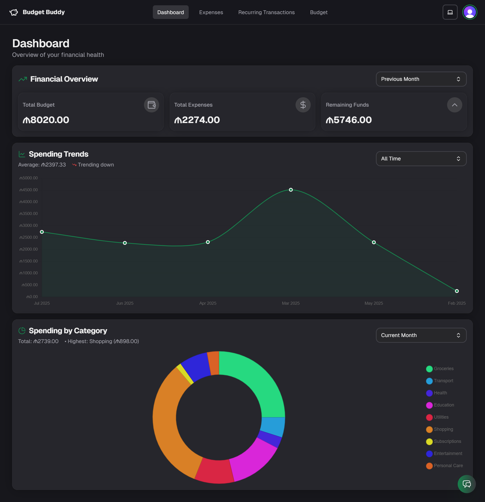
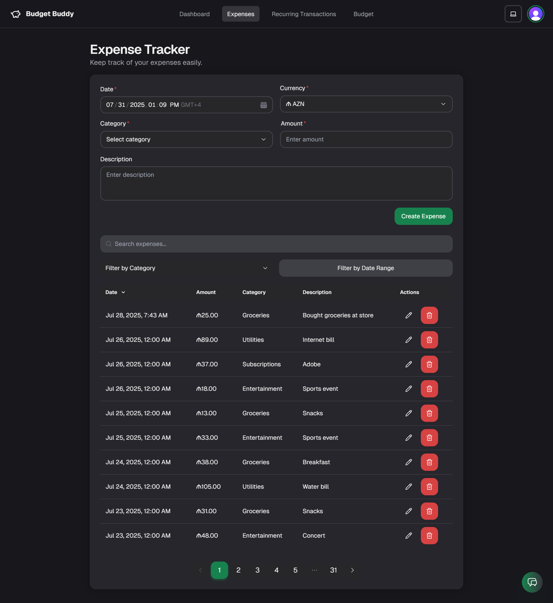
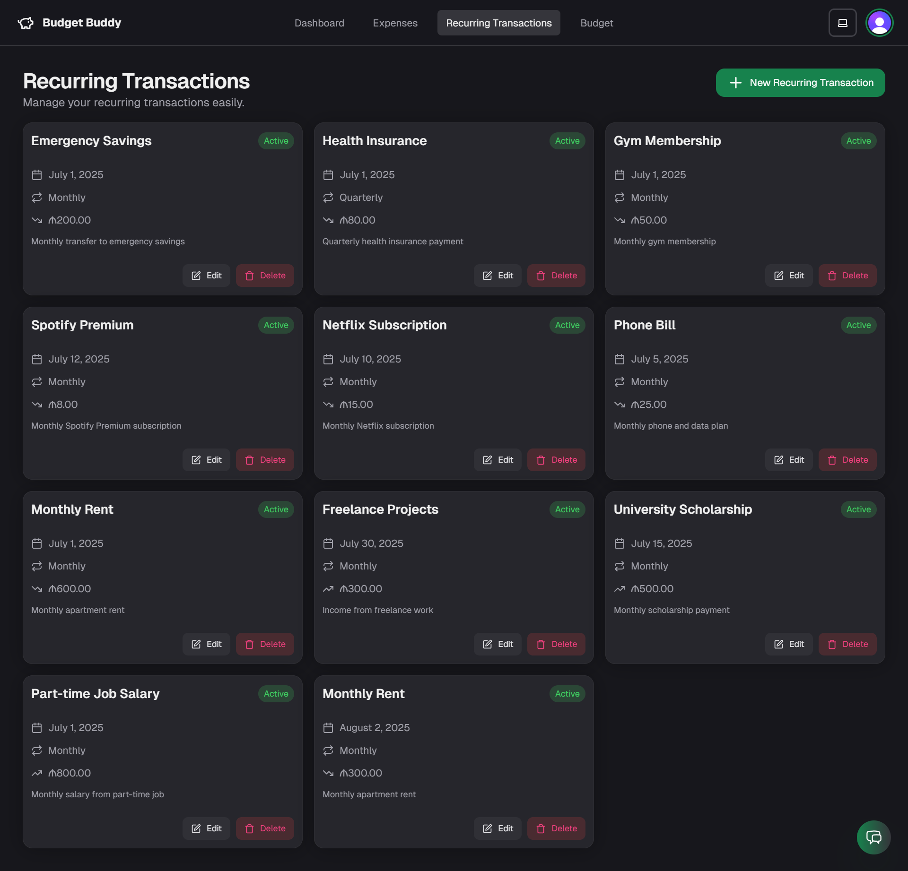
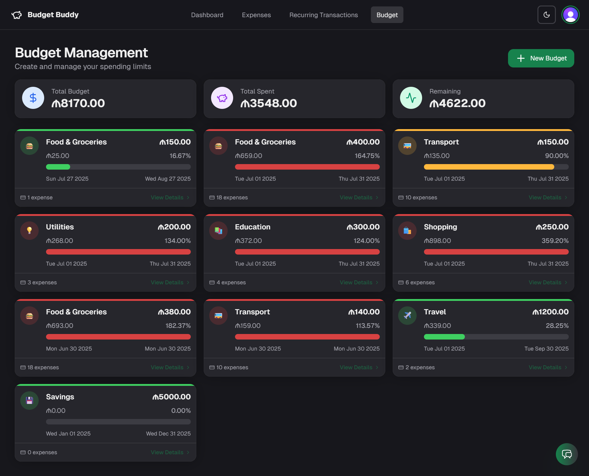
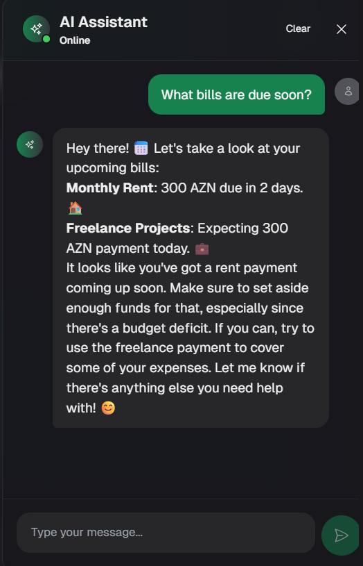
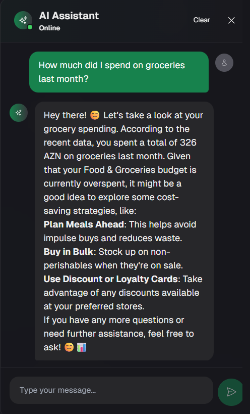

<h1 align="center">🧠 Student Budget Buddy</h1>
<p align="center">
    <i>Track smarter. Save better. Empowering students to take control of their financial journey.</i>
</p>

<p align="center">
    
</p>

<p align="center">
    
    
    
    
    
    
</p>

---

## 🚀 Features

- **Multi-Currency Expense Tracking:** Effortlessly track expenses in multiple currencies, allowing for accurate financial management regardless of location.
- **Category-Based Budgeting:** Create and manage budgets across various categories (e.g., food, rent, entertainment) to gain a clear understanding of spending habits.
- **Interactive Insights and Monthly Summaries:** Visualize spending patterns with interactive charts and receive comprehensive monthly summaries to identify areas for potential savings.
- **AI-Powered Savings Suggestions (Coming Soon):** Receive intelligent, AI-driven recommendations to optimize spending and achieve savings goals (e.g., personalized tips to reduce unnecessary expenses).
- **Clean, Mobile-First, Student-Focused Design:** Enjoy a user-friendly and intuitive experience with a responsive design optimized for mobile devices.

---

## 🛠️ Tech Stack

| Frontend              | Backend           | ORM     | Database   | Auth    | Deployment |
|----------------------|-------------------|---------|------------|---------|------------|
| Next.js 15 (App Router) | Node.js, Express | Prisma  | PostgreSQL | Clerk   | Vercel     |

---

## 📌 Project Status

🚧 Student Budget Buddy is currently under **active development**.

We're focused on refining the core budgeting experience and building out exciting AI-powered features to provide students with intelligent and personalized financial management tools.

---

## 🔮 Planned Features

What’s coming next:

- 🤖 **AI-Powered Budget Insights:** Receive smart, personalized feedback on spending habits, enabling data-driven decisions to optimize budget allocation.
- 💡 **Smart Saving Tips:** Leverage AI to identify and suggest opportunities to reduce wasteful spending and maximize savings potential.
- 🔁 **Recurring Expense Detection:** Automatically detect recurring expenses to provide a clear overview of fixed costs and facilitate proactive budget adjustments.
- 🧾 **Receipt Scanning:** Utilize OCR technology to scan receipts and automatically categorize expenses, simplifying expense tracking and reducing manual input.
- 📲 **PWA Support:** Enable a seamless, installable, and offline-capable mobile experience for convenient access to budgeting tools on the go.
- 👯 **Shared Budgets:** Facilitate collaborative budgeting and financial management with roommates, partners, or friends.

---

## 📸 Screenshots

| Dashboard Overview | Expense Tracker |
|--------------------|-----------------|
|  |  |

| Recurring Transactions | Budget Management |
|------------------------|-------------------|
|  |  |

| AI Assistant: Bills Due | AI Assistant: Grocery Insights |
|-------------------------|--------------------------------|
|  |  |

---

## ⚙️ Getting Started

```bash
# 1. Clone the repo
git clone https://github.com/muradyusubov/student-budget-buddy.git

# 2. Move into the folder
cd student-budget-buddy

# 3. Install dependencies
npm install

# 4. Setup environment variables
cp .env.example .env

# 5. Push the Prisma schema to your database
npx prisma db push

# 6. Run the development server
npm run dev
```

---

## 👤 Author

Built by [Murad Yusubov](https://github.com/biolater) — passionate about building intelligent web applications that solve real-world problems.

---

## 📬 Feedback

Found a bug or have a suggestion? Feel free to [open an issue](https://github.com/biolater/student-budget-buddy/issues) or reach out directly.

---